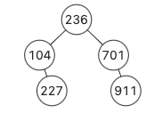

# PASS_W11
**in-built lists are allowed**, all `dict` and `sorted` are not allowed

### Q1: Minimum Absolute Difference in BST 
Given a Binary Search Tree (BST), return the minimum absolute difference between the values of any two different nodes in the tree.


Example 1:  
**Input**: `bst` of   
**Output**: 1   

Explanation: 2-1 = 1 (or 3-2 = 1)


Example 2:  
**Input**: `bst` of   
**Output**: 9

Explanation: 236-227 = 9

Note: 0 <= `TreeNode`.val <= 105

---

### Testing you algorithm
- To run tests, open terminal then:
```sh
python3 run_tests.py # and follow command line instructions
```

- If you encounter errors with the above, make sure that at least python runs on terminal
```sh
python3
```

- You may be directed to Microsoft Store (Windows), if so install python from there
- For if issues persist on Mac,  see this: https://docs.python-guide.org/starting/install3/osx/
